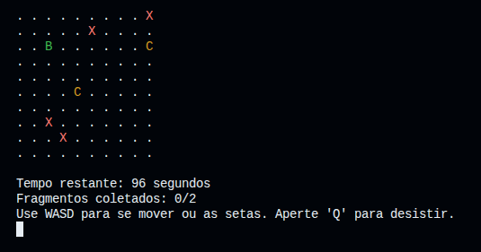

# Point Rush

**PT** | [EN](#point-rush--english)

Jogo de terminal desenvolvido em C onde o objetivo é coletar todos os fragmentos do mapa no menor tempo possível, enquanto evita a corrupção que avança a cada movimento.

---

## Demonstração



## Funcionalidades

- Mapa gerado no terminal com interface colorida via ANSI Escape Codes
- Corrupção (`X`) que se espalha progressivamente a cada movimento do jogador
- Sistema de ranking persistente baseado no tempo de conclusão
- Níveis com dificuldade progressiva
- Múltiplas condições de fim de jogo
- Controles via WASD ou setas do teclado

## Gameplay

O jogador (`B`) navega pelo mapa coletando fragmentos (`C`) enquanto a corrupção (`X`) avança a cada movimento. Quanto menor o tempo para coletar todos os fragmentos, melhor a posição no ranking.

**O jogo termina quando:**
- Todos os fragmentos são coletados → vitória
- O tempo esgota
- O jogador colide com a corrupção
- Não há movimentos possíveis
- O jogador desiste com `Q`

## Controles

| Tecla | Ação |
|-------|------|
| `W` / `↑` | Mover para cima |
| `A` / `←` | Mover para esquerda |
| `S` / `↓` | Mover para baixo |
| `D` / `→` | Mover para direita |
| `Q` | Desistir |

## Compilação e Execução

**Requisitos:** GCC, Linux ou macOS

```bash
# Compilar
gcc point_rush.c -o point_rush

# Executar
./point_rush
```

## Estrutura do Projeto

```
Point-Rush/
├── point_rush.c
├── LICENSE
└── README.md
```

## Objetivo Educacional

Projeto desenvolvido como trabalho de faculdade para praticar:

- Programação em C
- Lógica de jogos e estruturas de controle
- Interface visual com ANSI Escape Codes
- Manipulação de arquivos (ranking persistente)
- Organização de código

## Futuras Melhorias

- Compatibilidade com Windows
- Novos modos de jogo
- Melhorias no sistema de ranking
- Melhorias visuais no terminal

## Autor

**Wilson Klein Cecchi** — [GitHub](https://github.com/Wilson-Cecchi)

## Licença

Este projeto está licenciado sob a [MIT License](LICENSE).

---

# Point Rush — English

**[PT](#point-rush)** | EN

A terminal game written in C where the goal is to collect all fragments on the map as fast as possible, while avoiding corruption that spreads with every move.

---

## Demo


## Features

- Terminal-based map with colorful interface via ANSI Escape Codes
- Corruption (`X`) that spreads progressively with each player move
- Persistent ranking system based on completion time
- Levels with progressive difficulty
- Multiple game-over conditions
- WASD and arrow key controls

## Gameplay

The player (`B`) navigates the map collecting fragments (`C`) while corruption (`X`) advances with each move. The faster you collect all fragments, the better your ranking position.

**The game ends when:**
- All fragments are collected → victory
- Time runs out
- Player collides with corruption
- No moves are available
- Player quits with `Q`

## Controls

| Key | Action |
|-----|--------|
| `W` / `↑` | Move up |
| `A` / `←` | Move left |
| `S` / `↓` | Move down |
| `D` / `→` | Move right |
| `Q` | Quit |

## Build & Run

**Requirements:** GCC, Linux or macOS

```bash
# Compile
gcc point_rush.c -o point_rush

# Run
./point_rush
```

## Project Structure

```
Point-Rush/
├── point_rush.c
├── LICENSE
└── README.md
```

## Educational Goal

This project was developed as a college assignment to practice:

- C programming
- Game logic and control structures
- Visual interface with ANSI Escape Codes
- File manipulation (persistent ranking)
- Code organization

## Future Improvements

- Windows compatibility
- New game modes
- Improved ranking system
- Visual improvements in the terminal

## Author

**Wilson Klein Cecchi** — [GitHub](https://github.com/Wilson-Cecchi)

## License

This project is licensed under the [MIT License](LICENSE).
